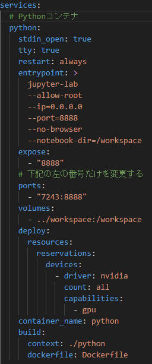
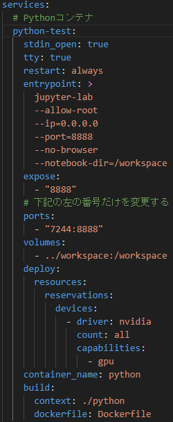

# NLP拡張済みパック(Python+NEologd+NVCC+RAPIDS)(ベータ版)

## パッケージ内容
### Python
- numpy  
- pandas  
- scipy  
- scikit-learn  
- pycaret  
- matplotlib  
- japanize_matplotlib  
- mlxtend  
- seaborn 
- plotly  
- requests  
- beautifulsoup4 
- selenium  
- tqdm  
- gensim  
- janome  
- mecab-python3  
- sentencepiece  
- accelerate  
- nltk  
- spacy  
- transformers  
- transformers[ja]  
- tensorflow[and-cuda]  
- tensorrt  
- torch  
- pytorch_lightning  
- pytorch-transformers  
- keras  
- deepspeed  

## 使い方
1. このリポジトリをcloneする．
2. docker-compose.ymlのPythonサービスの自分のポート番号とPythonのコンテナ名を変更する．
例）以下の画像では，ポート番号を7243から7244，コンテナ名をpythonからpython-testに変更している．

3. `docer compose up -d`を実行(Dockerfileの中身を変更したら，`docker compose up -d --build`を実行)．
4. `docker compose exec <変更したコンテナ名> bash`を実行．
2の例をとると，`docker compose python-test bash`
5. コンテナ内に入るので，`jupyter notebook passowrd`を実行し，任意のパスワードを入力．
※このコマンドでエラーが発生したら，`jupyter lab password`を実行．
6. Ctrl+Dもしくは，`exit`を入力し，`docker compose down`を実行．
7. `docer compose up -d`を入力し，コンテナを再起動する．
8. (応用)入りたいコンテナがあったら，names.csvを参照する．
※yml-readコンテナには入れません．